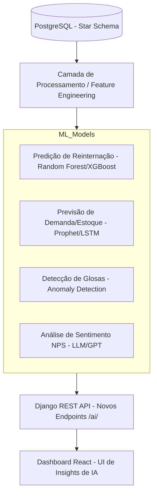

# Arquitetura de Inteligência Artificial: Health Analytics

Esta proposta detalha a integração de Inteligência Artificial (IA) ao ecossistema **Health Analytics Dashboard**, visando transformar dados históricos em insights preditivos e prescritivos.

---

## 1. Objetivos da IA no Projeto
O foco da camada de IA é resolver problemas críticos da gestão hospitalar:
- **Redução de Custos**: Predição de glosas financeiras e otimização de estoque.
- **Qualidade do Cuidado**: Predição de risco de reinternação em 30 dias.
- **Eficiência Operacional**: Previsão de demanda por procedimentos e ocupação de leitos.
- **Segurança do Paciente**: Detecção de anomalias em erros de medicação.

---

## 2. Diagrama da Arquitetura de IA

---

## 3. Componentes da Camada de IA

### A. Processamento (Feature Engineering)
- **Tecnologias**: Pandas, Scikit-learn.
- **Função**: Transformar os dados das tabelas de Fato (Atendimentos, Estoque, Financeiro) em vetores de características para os modelos.

### B. Modelos Propostos

| Caso de Uso | Algoritmo Sugerido | Dados de Origem |
| :--- | :--- | :--- |
| **Risco de Reinternação** | Random Forest / XGBoost | `FatoAtendimentos`, `DimPaciente` |
| **Previsão de Estoque** | Facebook Prophet / ARIMA | `FatoEstoque`, `DimTempo` |
| **Predição de Glosas** | Isolation Forest (Anomalias) | `FatoFinanceiro`, `DimConvenio` |
| **Otimização de Escalas** | Algoritmos Genéticos / OptaPlanner | `FatoEscalaMedica`, `FatoAtendimentos` |

### C. Camada de Integração (Django AI Module)
Criar um novo app no Django chamado `ai_engine`:
- **Serializers**: Para formatar as predições.
- **Views**: Endpoints que disparam as inferências (ex: `GET /api/ai/predict-readmission/`).
- **Celery/Redis**: Para treinamento de modelos em background sem travar a API.

---

## 4. Visualização no Frontend (React)

A interface de IA será integrada ao dashboard atual através de:
- **AI Insights Cards**: Cards com "Previsão para os próximos 30 dias".
- **Risk Score**: Badge colorido nos dashboards de pacientes indicando "Alto Risco".
- **Alertas Preditivos**: Notificações sobre estoque que ficará crítico antes da próxima entrega.

---

## 5. Tecnologias de IA Sugeridas
- **Linguagem**: Python 3.12 (já utilizado no backend).
- **Data Science**: Scikit-learn, Pandas, NumPy.
- **Deep Learning (Opcional)**: PyTorch ou TensorFlow para séries temporais complexas.
- **LLM (Opcional)**: OpenAI API ou Llama 3 para análise de notas médicas e NPS.

---

## 6. Roteiro de Implementação (Roadmap)

1.  **Fase 1: Preparação de Dados**: Criar views no PostgreSQL que consolidam as características necessárias.
2.  **Fase 2: MVP Preditivo**: Implementar o primeiro modelo (ex: Risco de Reinternação).
3.  **Fase 3: Integração API**: Expor os resultados via Django REST.
4.  **Fase 4: UI de IA**: Adicionar componentes de visualização preditiva no React.

---
**Desenvolvido como proposta de evolução tecnológica para o Health Analytics Dashboard.**
